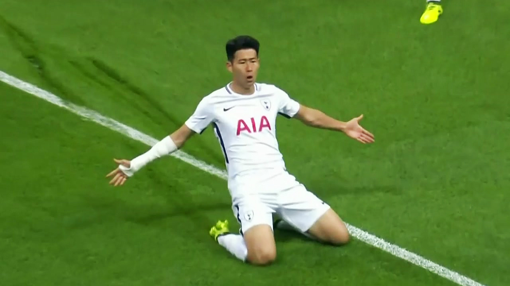
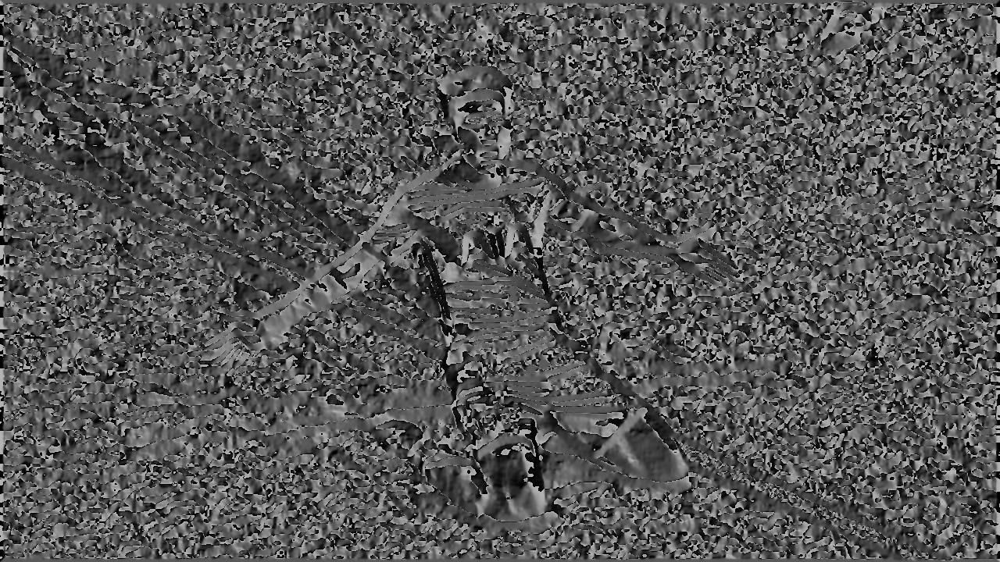
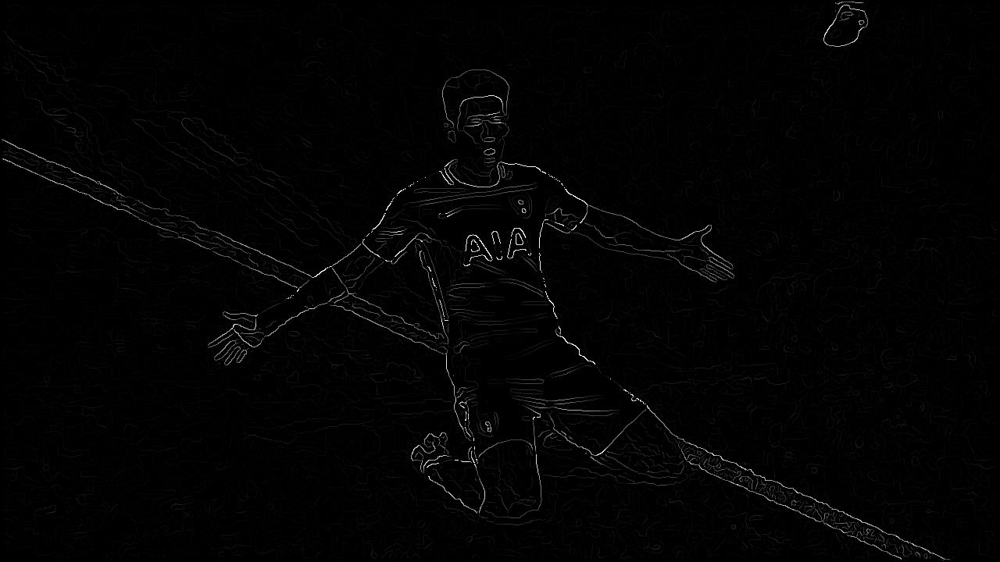
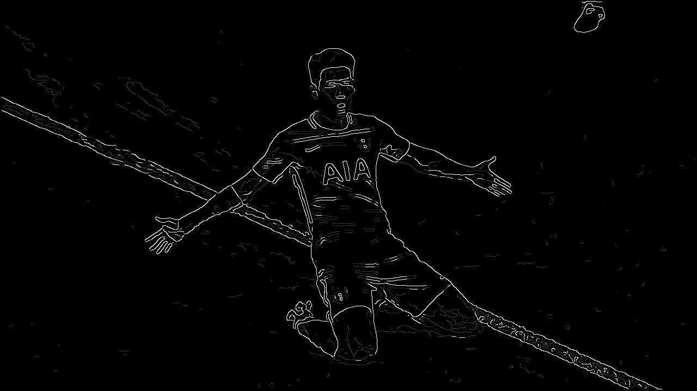
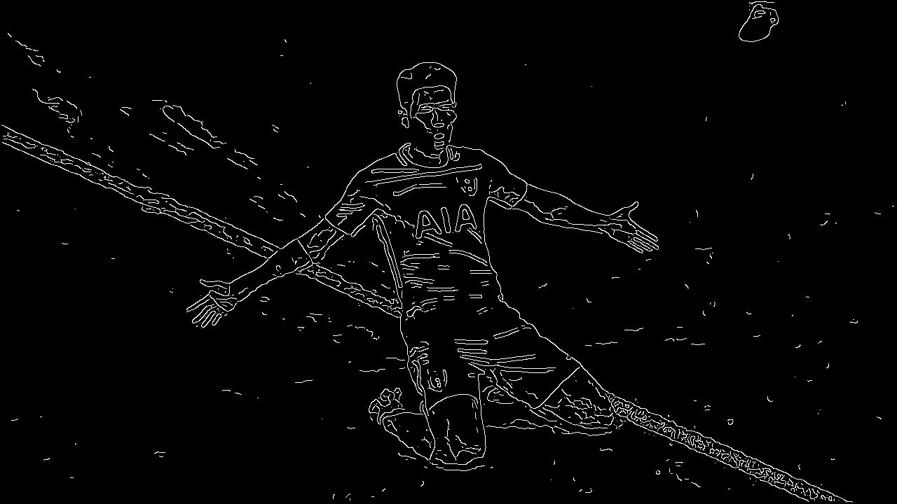

# CannyEdgeDetector

## Project Overview
The CannyEdgeDetector is a complete implementation of the Canny edge detection algorithm in Python. This algorithm is a multi-stage process that includes noise reduction, gradient calculation, non-maximum suppression, double thresholding, and edge tracking by hysteresis. It is known for its robustness and precision in detecting a wide range of edges in images.

## Features
- **Gaussian Blur**: Applies a Gaussian filter to smooth the image and reduce noise.
- **Gradient Calculation**: Utilizes the Sobel operator to find the intensity gradients of the image.
- **Non-Maximum Suppression**: Thins out edges to ensure that only the most significant edges are preserved.
- **Double Thresholding**: Determines potential edges by distinguishing between strong, weak, and non-relevant pixels.
- **Edge Tracking by Hysteresis**: Finalizes the detection of edges by suppressing all the other edges that are weak and not connected to strong edges.

## How It Works
1. The image is first smoothed by a Gaussian filter to reduce noise.
2. The Sobel operator is then applied to find the gradient magnitude and direction for each pixel.
3. Non-maximum suppression is applied to get rid of spurious response to edge detection.
4. The double threshold method helps to identify strong, weak, and non-relevant pixels.
5. Finally, edge tracking by hysteresis is applied, which transforms weak pixels into strong ones if they are connected to strong pixels.

## Input


## Results
This project includes a set of result images which illustrate the steps of the Canny edge detection process:
- Gaussian Filtered Image


- Gradient Magnitude Image (after Sobel filtering)


- Gradient Direction Image (after Sobel filtering)



- Non-Maximum Suppressed Image



- Double Threshold Image



- Final Edge Detection Image using Hysteresis Thresholding



## Getting Started
To run this project on your local machine, follow these steps:

### Prerequisites
- Python 3.x
- NumPy library
- PIL library

### Installation
1. Clone the repository to your local machine.
   ```bash
   git clone https://github.com/yourusername/CannyEdgeDetector.git
    ```

2. Navigate to the cloned repository.
    ```bash
    cd CannyEdgeDetector
    ```

3. Install the required packages.
    ```bash
    pip install numpy pillow
    ```

### Running the Detector
1. Place your image in the images directory.
2. Run the main script.
    ```bash
    python canny_edge_detector.py
    ```